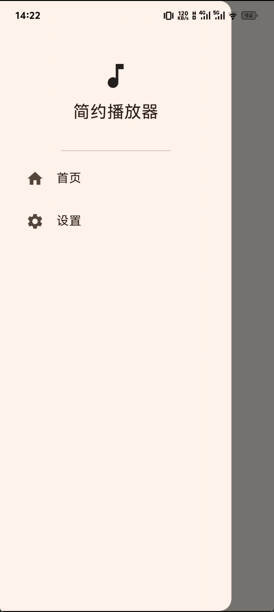
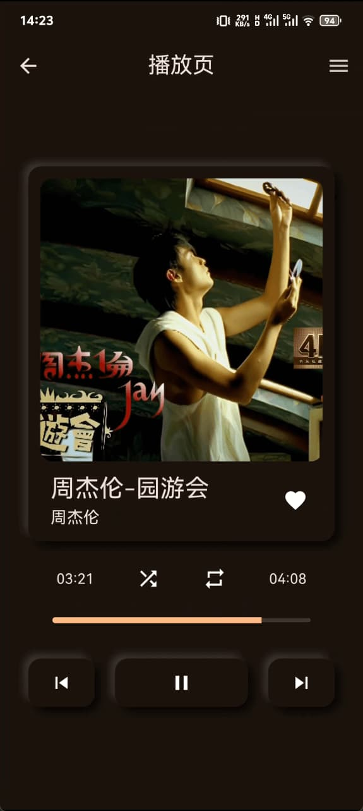

## 项目一：天气app

项目地址：[https://github.com/jianhua1996/flutter-weather](https://github.com/jianhua1996/flutter-weather)

## 项目二：音乐播放器

    
    

    

    
    

    

项目地址：[https://github.com/jianhua1996/flutter-music-player](https://github.com/jianhua1996/flutter-music-player)