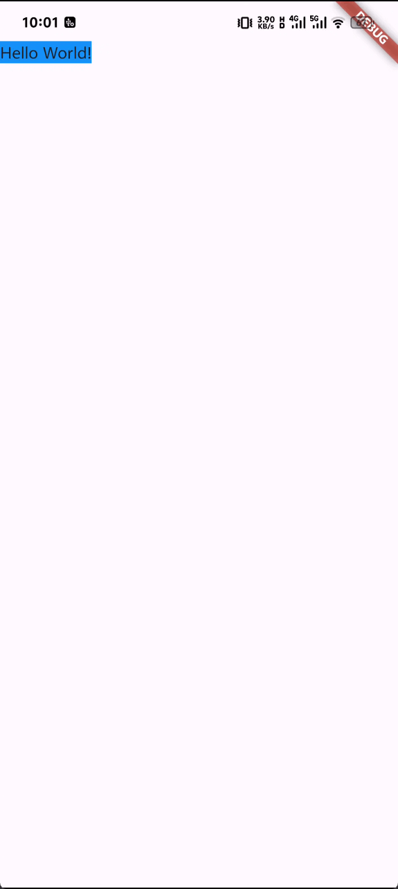
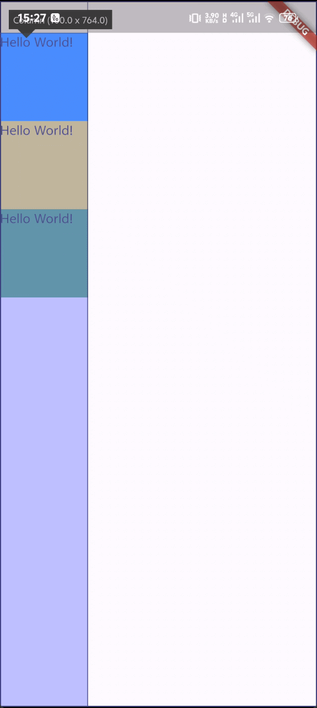
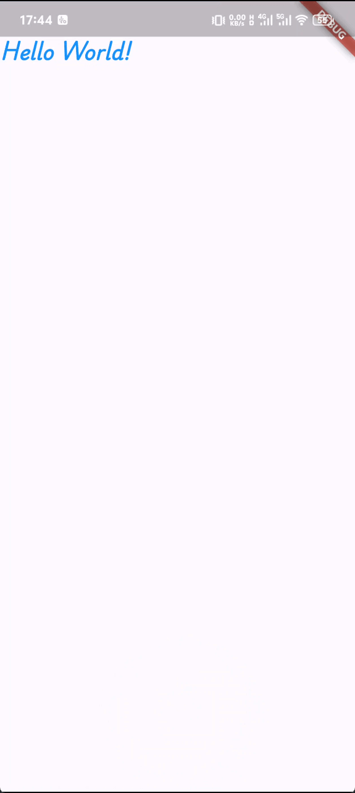
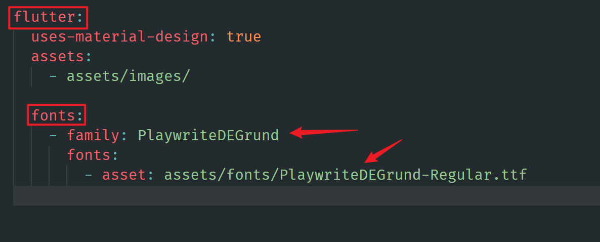
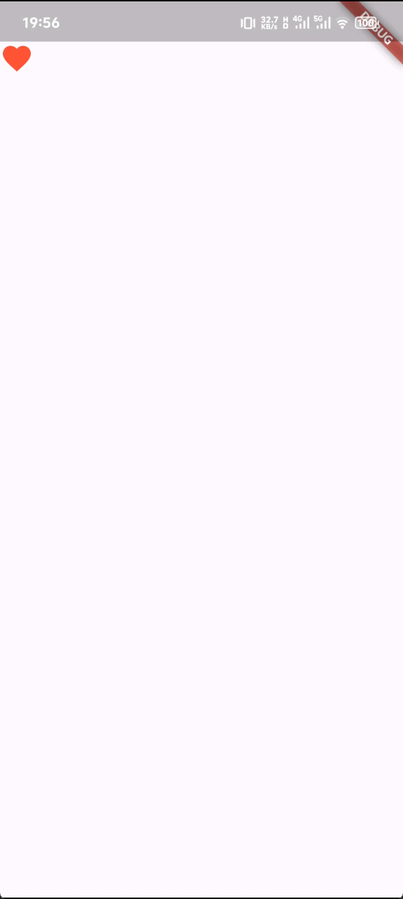

## 1. Container 组件
Container 组件是 Flutter 中的`布局组件`，可以类比为 web 开发中的 div 标签。

它属于单一子组件的容器，接受`一个` child 参数作为子组件， child 类型**可以是任何 widget，包括其他的 Container 组件**。

**容器在没有子元素的情况下会尽量变得尽可能大，除非传入的约束条件是无界的**，在这种情况下，它们会尽量变得尽可能小。


```dart
Container(
  decoration: BoxDecoration(
    color: Colors.blue,
  ),
)
```
以上代码效果如下：


**有子元素的容器会根据其子元素的大小来调整自身大小**。

```dart
Container(
  decoration: BoxDecoration(
    color: Colors.blue,
  ),
  child: Text('Hello World!'),
),
```
以上代码效果如下：


> Tips: 如果你希望所有的元素都在安全区域展示，不被系统状态栏、导航栏等系统元素遮挡，可以使用 SafeArea 组件。

```dart
SafeArea(
  child: Container(
    decoration: BoxDecoration(
      color: Colors.blue,
    ),
    child: Text('Hello World!'),
  ),
)
```
以上代码效果如下：



如果你给 Container 组件设置了 width 和 height，那么它将会按照你指定的尺寸而不是子组件的尺寸来进行布局。

```dart
SafeArea(
  child: Container(
    decoration: BoxDecoration(
      color: Colors.blue,
    ),
    width: 100,
    height: 100,
    child: Text('Hello World!'),
  ),
)
```

以上代码效果如下：


### 1.1 关于外边距（magin）和内边距（padding）

container 组件可以通过 margin 和 padding 属性来设置外边距和内边距。（flutter中外边距和内边距的概念等同于web开发中的 margin 和 padding）

生成内外边距的方法：

- EdgeInsets.all 生成四个方向上都相同的内外边距
- EdgeInsets.symmetric 按照水平或垂直方向生成内外边距
- EdgeInsets.fromLTRB 按照左、上、右、下四个方向生成内外边距
- EdgeInsets.only 按照指定方向生成内外边距

```dart
SafeArea(
  child: Container(
    // margin: EdgeInsets.all(10),
    // padding: EdgeInsets.symmetric(horizontal: 20, vertical: 10),
    margin: const EdgeInsets.fromLTRB(10, 10, 10, 10),
    padding:
        const EdgeInsets.only(left: 20, top: 10, right: 20, bottom: 10),
    decoration: const BoxDecoration(
      color: Colors.blue,
    ),
    width: 100,
    height: 100,
    child: const Text('Hello World!'),
  ),
),

```

## 2. Rows 和 Columns 组件

Rows 和 Columns 组件同样是 Flutter 中的`布局组件`，可以类比为 web 开发中的 flex 布局。


它们都属于多子组件的容器，接受`多个` child 参数作为子组件，入口参数为`children`， children指定的子组件类型**可以是任何 widget 或 widget 集合，包括其他的 Rows 和 Columns 组件**。

```dart
SafeArea(
  child: Column(
    children: [
      Container(
        decoration: const BoxDecoration(
          color: Colors.blue,
        ),
        width: 100,
        height: 100,
        child: const Text('Hello World!'),
      ),
      Container(
        decoration: const BoxDecoration(
          color: Colors.yellow,
        ),
        width: 100,
        height: 100,
        child: const Text('Hello World!'),
      ),
      Container(
        decoration: const BoxDecoration(
          color: Colors.green,
        ),
        width: 100,
        height: 100,
        child: const Text('Hello World!'),
      ),
    ],
  ),
),
```

以上代码效果如下：


**Columns 组件总是会在垂直方向上尽可能的占用空间，而 Rows 组件总是在水平方向上尽可能的占用空间。**

如图所示：



> 如果你希望更改这个默认行为，可以通过更改 mainAxisSize 属性来控制 Rows 和 Columns 组件在主轴方向上的尺寸分配。
> ```dart
> Column(
>   mainAxisSize: MainAxisSize.min,
>)
> ```

另外，Columns 组件还可以设置 verticalDirection 属性来控制子组件的排列方向。

```dart

SafeArea(
  child: Column(
    // mainAxisSize: MainAxisSize.min,
    verticalDirection: VerticalDirection.up,
    children: [
      Container(
        decoration: const BoxDecoration(
          color: Colors.blue,
        ),
        width: 100,
        height: 100,
        child: const Text('Hello World!'),
      ),
      Container(
        decoration: const BoxDecoration(
          color: Colors.yellow,
        ),
        width: 100,
        height: 100,
        child: const Text('Hello World!'),
      ),
      Container(
        decoration: const BoxDecoration(
          color: Colors.green,
        ),
        width: 100,
        height: 100,
        child: const Text('Hello World!'),
      ),
    ],
  ),
)

```

以上代码效果如下：


以及，通过 `mainAxisAlignment` 属性来控制子组件在主轴方向上的对齐方式，有效的值有： 
- MainAxisAlignment.start
- MainAxisAlignment.end
- MainAxisAlignment.center
- MainAxisAlignment.spaceBetween
- MainAxisAlignment.spaceAround
- MainAxisAlignment.spaceEvenly 子组件间距均匀分布

通过 `crossAxisAlignment` 属性来控制子组件在交叉轴方向上的对齐方式，有效的值有：
- CrossAxisAlignment.start
- CrossAxisAlignment.end
- CrossAxisAlignment.center
- CrossAxisAlignment.stretch  拉伸子组件，占满交叉轴方向的全部空间
- CrossAxisAlignment.baseline

**这些基本上和 web 开发中的 flex 布局的概念是一致的， mainAxisAlignment 和 crossAxisAlignment 也和 justify-content 和 align-items 相对应**


## 3. Image 组件与图片导入

Image 组件是 Flutter 中的`图片组件`，用来展示图片。

它提供多种构造函数，用于指定加载图像的多种方式：

- Image.asset 加载本地资源图片
- Image.network 加载网络图片
- Image.file 加载本地文件图片

[查看上述方式的详细用法](https://api.flutter-io.cn/flutter/widgets/Image-class.html)

Image组件支持的图片格式有： **JPEG, PNG, GIF, Animated GIF, WebP, Animated WebP, BMP, and WBMP**。

在默认的构造函数中，通过`image`参数传入一个指定的`ImageProvider`类型的值，就可以加载指定的图片。

`ImageProvider` 是一个抽象类，用于提供图片资源。常见的 ImageProvider 类型有 `AssetImage`、`NetworkImage`、`FileImage` 等。

```dart
 Image(
  image: AssetImage('assets/images/xxx.png'),
  width: 100,
  height: 100,
),
```

> 需要注意的是，在使用`AssetImage`类型的`ImageProvider`时，需要先在 pubspec.yaml 文件中配置图片资源路径来导入图片资源。
> 
> 
> 

## 4. Text 组件与自定义字体

Text 组件是 Flutter 中的`文本组件`，用来展示文本。

通过指定`style`参数，可以设置文本的字体大小、颜色、粗细、斜体等样式。[查看更多样式设置](https://api.flutter-io.cn/flutter/widgets/Text-class.html)

```dart
Text(
  'Hello World!',
  style: TextStyle(
    fontSize: 20,
    color: Colors.blue,
    fontWeight: FontWeight.bold,
    fontStyle: FontStyle.italic,
  ),
),
```

以上代码效果如下：


### 4.1 自定义字体

Flutter 支持自定义字体，通过 `fontFamily` 参数指定字体名称，就可以使用该字体渲染文本。

```dart
const Text(
  'Hello World!',
  style: TextStyle(
    fontSize: 20,
    color: Colors.blue,
    fontWeight: FontWeight.bold,
    fontStyle: FontStyle.italic,
    fontFamily: 'PlaywriteDEGrund',
  ),
),
```

以上代码效果如下：




> 需要注意的是，自定义字体同样需要在 pubspec.yaml 文件中配置和导入。
>
> 
> 
> 


## 5. Icon 组件

Icon 组件是 Flutter 中的`图标组件`，用来展示具体的图标类型。

通常的做法是**通过指定 flutter 中预定义的 material IconData 枚举值来展示具体的图标**。[查看所有图标类型](https://api.flutter-io.cn/flutter/material/Icons-class.html)

```dart
Icon(
  Icons.favorite,
  size: 30,
  color: Colors.red,
),
```


以上代码效果如下：




## 6. Expanded 组件

Expanded 组件同样是 Flutter 中的`布局组件`，它可以用来扩展其子组件的尺寸。

使用 **Expanded 组件可以使 Row、Column 或 Flex 布局的子元素沿着主轴扩展以填充可用空间**（例如，对于 Row 是水平扩展，对于 Column 是垂直扩展）。**如果有多个子元素扩展，可用空间将根据弹性因子`flex`按比例在它们之间进行分配**。

> 注意： Expanded 组件只能作为 Row、Column 或 Flex 布局的子元素使用。

[查看更多 Expanded 组件用法](https://api.flutter-io.cn/flutter/widgets/Expanded-class.html)


```dart
Row(
  children: [
    Expanded(
      flex: 2, // 比例因子
      child: Container(
        decoration: BoxDecoration(
          color: Colors.blue,
        ),
        width: 100, // 这里设置的宽度不会生效
        height: 100,
        child: Text('Hello World!'),
      ),
    ),
    Expanded(
      child: Container(
        decoration: BoxDecoration(
          color: Colors.yellow,
        ),
        width: 100, // 这里设置的宽度不会生效
        height: 100,
        child: Text('Hello World!'),
      ),
    ),
    Expanded(
      flex: 2, // 比例因子
      child: Container(
        decoration: BoxDecoration(
          color: Colors.green,
        ),
        width: 100, // 这里设置的宽度不会生效
        height: 100,
        child: Text('Hello World!'),
      ),
    ),
  ],
),
```


以上代码效果如下：


## 7. Padding 组件

Padding 组件也是 Flutter 中的`布局组件`之一，用来给父组件添加内边距。

它接受`一个` padding 参数，该参数是一个`EdgeInsetsGeometry`类型的值，用来设置四个方向上的内边距。

具体用法和Container组件中的padding属性类似。[回到 1.1](#_1-1-关于外边距-magin-和内边距-padding)

[更多 Padding 组件用法](https://api.flutter-io.cn/flutter/widgets/Padding-class.html)

```dart
Padding(
  padding: const EdgeInsets.all(20),
  child: Container(
    decoration: BoxDecoration(
      color: Colors.blue,
    ),
    width: 100,
    height: 100,
    child: Text('Hello World!'),
  ),
),
```

