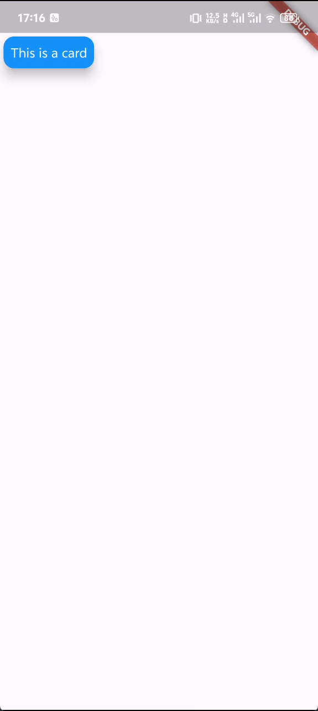
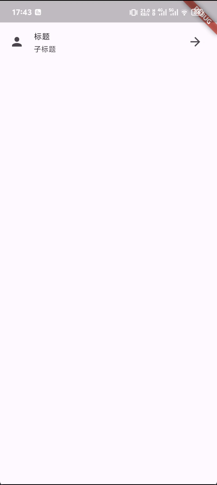
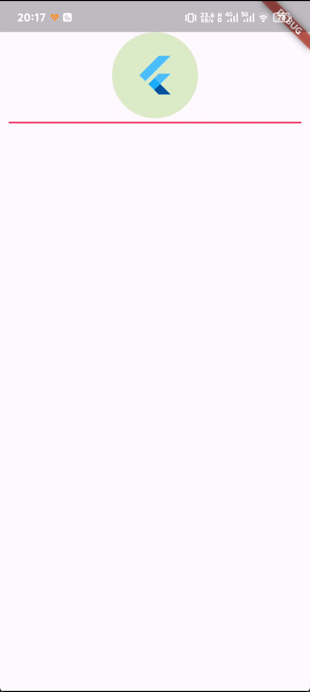
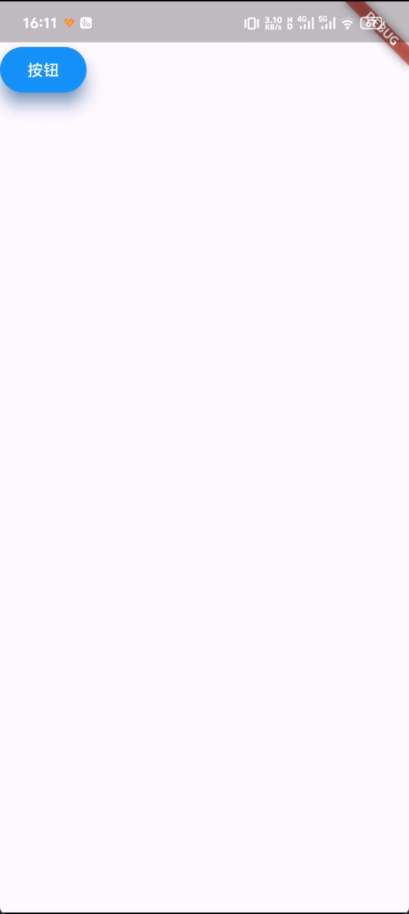

## 1. Card 组件

Card 组件是 Flutter 中最常用的组件之一，它可以用来显示一些内容，**它的默认样式是一个略微圆角且带有阴影凸起的面板**，Card 组件可以包含一个子组件，也可以没有子组件。Card 组件的主要属性有：

- color：Card 组件的背景颜色。
- elevation：Card 组件的阴影大小。
- shape：Card 组件的形状。
- clipBehavior：Card 组件的裁剪行为。
- child：Card 组件的子组件。

[查看更多属性](https://api.flutter-io.cn/flutter/material/Card-class.html)

Card 组件的示例代码如下：

```dart
Card(
  color: Colors.blue,
  elevation: 10,
  child: Padding(
    padding: const EdgeInsets.all(8.0),
    child: Text(
      'This is a card',
      style: TextStyle(color: Colors.white),
    ),
  ),
),
```

效果如下：




## 2. ListTile 组件

ListTile 组件是 Flutter 中用来显示列表项的组件，通常与 Listview 组件、Card 组件等一起搭配使用，它可以**用来展示一个标题、一段描述、一张图片或者一个小部件**，ListTile 组件的主要属性有：

- leading：ListTile 组件的左侧组件，通常是一个小部件。
- title：ListTile 组件的标题。
- subtitle：ListTile 组件的副标题。
- trailing：ListTile 组件的右侧组件，通常是一个小部件。
- dense：ListTile 组件是否显示为紧凑模式。
- enabled：ListTile 组件是否可以点击。
- onTap：ListTile 组件的点击事件。


[查看更多属性](https://api.flutter-io.cn/flutter/material/ListTile-class.html)

ListTile 组件的示例代码如下：

```dart
ListTile(
  leading: Icon(Icons.person),
  title: Text('标题'),
  subtitle: Text('子标题'),
  trailing: Icon(Icons.arrow_forward),
  dense: true,
  enabled: true,
  onTap: () {
    print('ListTile 被点击了');
  },
)
```


效果如下：




## 3. CircleAvatar 组件

CircleAvatar 组件是一个圆形的头像组件，它可以**用来显示用户头像或者其他圆形的图片**，CircleAvatar 组件的主要属性有：

- backgroundImage：CircleAvatar 组件的背景图片。
- backgroundColor：CircleAvatar 组件的背景颜色。
- foregroundColor：CircleAvatar 组件的前景颜色。
- radius：CircleAvatar 组件的圆角半径。
- child：CircleAvatar 组件的子组件。


[查看更多属性](https://api.flutter-io.cn/flutter/material/CircleAvatar-class.html)

CircleAvatar 组件的示例代码如下：

```dart
CircleAvatar(
  backgroundImage:
      const NetworkImage('https://www.example.com/example.jpg'),
  backgroundColor: Colors.lightGreen.shade100,
  radius: 50,
  child: const FlutterLogo(
    size: 50,
  ),
),
```

效果如下：


## 4. Divider 组件

Divider 组件是一个分割线组件，它可以**用来分隔不同列表项或者不同区域**，Divider 组件的主要属性有：

- height：Divider 组件的高度。
- thickness：Divider 组件的粗细。
- indent：Divider 组件距离左侧距离。
- endIndent：Divider 组件距离右侧距离。
- color：Divider 组件的颜色。


[查看更多属性](https://api.flutter-io.cn/flutter/material/Divider-class.html)


Divider 组件的示例代码如下：

```dart
Column(
  children: [
    CircleAvatar(
      backgroundImage:
          const NetworkImage('https://www.example.com/example.jpg'),
      backgroundColor: Colors.lightGreen.shade100,
      radius: 50,
      child: const FlutterLogo(
        size: 50,
      ),
    ),
    const Divider(
      height: 10,
      thickness: 2,
      indent: 10,
      endIndent: 10,
      color: Colors.pink,
    ),
  ],
)
```


效果如下：



## 5. ElevatedButton 组件

ElevatedButton 组件是一个**带有阴影的按钮组件**，它可以**用来触发一些重要的操作，比如提交表单、打开新页面**等，ElevatedButton 组件的主要属性有：


- onPressed：按钮点击事件。
- style：按钮样式。
- child：按钮子组件。


[查看更多属性](https://api.flutter-io.cn/flutter/material/ElevatedButton-class.html)


ElevatedButton 组件的示例代码如下：

```dart
ElevatedButton(
  onPressed: () {
    print('按钮被点击了');
  },
  style: ElevatedButton.styleFrom(
    foregroundColor: Colors.white,
    backgroundColor: Colors.blue,
    shadowColor: Colors.blue.shade700,
    elevation: 12,
  ),
  child: Text('按钮'),
),
```


效果如下：



## 6. GestureDetector 组件

GestureDetector 组件是一个**手势监听器组件**，它可以**用来监听用户的手势操作，比如滑动、点击、长按等**，GestureDetector 组件的主要属性有：

- onTap：手指单击事件。
- onDoubleTap：手指双击事件。
- onLongPress：手指长按事件。
- child：手势监听器子组件。

[查看更多属性](https://api.flutter-io.cn/flutter/widgets/GestureDetector-class.html)


GestureDetector 组件的示例代码如下：

```dart
GestureDetector(
  onTap: () {
    print('手指单击了');
  },
  onDoubleTap: () {
    print('手指双击了');
  },
  onLongPress: () {
    print('手指长按了');
  },
  child: Container(
    width: 100,
    height: 100,
    color: Colors.blue,
  ),
),
```


效果如下：


