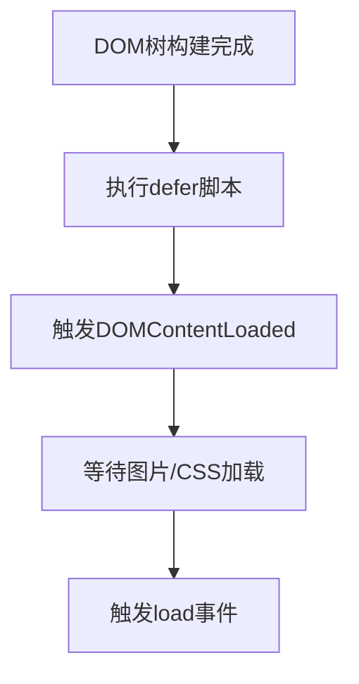
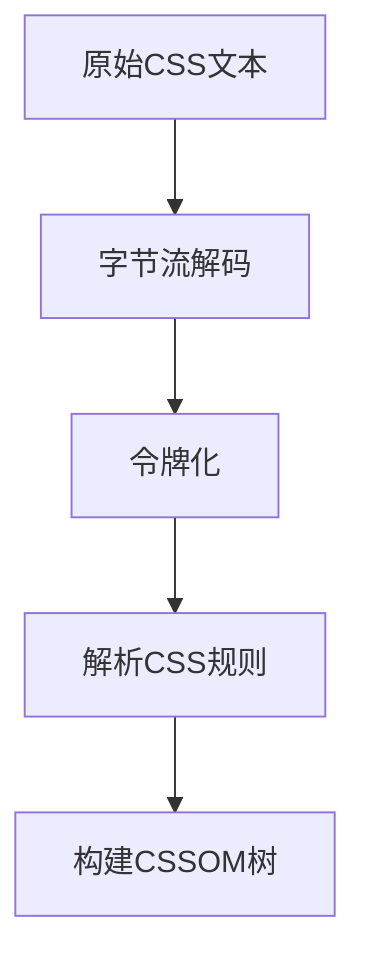
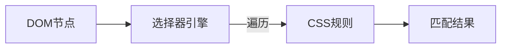
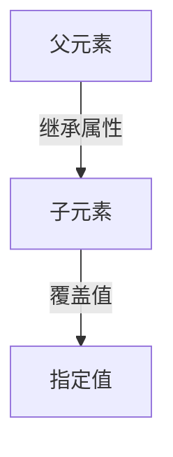
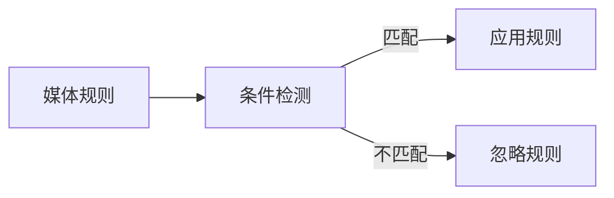
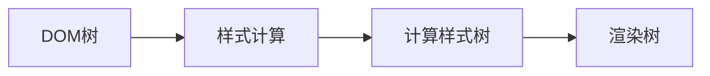

## 浏览器的多进程架构

### 进程与线程

**进程**：指计算机中已执行的程序，曾经是分时系统的基本运作单位。 <br>
**在面向进程设计的系统中，是程序的基本执行实体**；<br>**在面向线程设计的系统中**，进程本身不是基本执行单位，而**是线程的容器**，参考 [进程](https://zh.wikipedia.org/zh-cn/%E8%A1%8C%E7%A8%8B)

**线程**：在计算机科学中，是将进程划分为两个或多个线程（实例）或子进程，由单处理器（单线程）或多处理器（多线程）或多核处理系统并发执行， 参考 [线程](https://zh.wikipedia.org/zh-cn/%E7%BA%BF%E7%A8%8B)

### 浏览器的进程架构

**现代浏览器一般都是多进程架构**，拿 chrome 来说，一个浏览器会启动包括

- 浏览器主进程
- GPU 进程
- 网络进程
- 存储进程
- 渲染进程
- 插件进程

等进程在内的多个进程，每个进程都有自己的内存空间，进程之间通过 `IPC` 进行通信。 <br>
下面是浏览器的进程截图：

<ImageBuilder :source="['浏览器进程架构.png']" size="medium"/>

其中，**渲染进程**是我们最应该关注的进程，它负责通过一系列渲染步骤（又称作浏览器渲染管线）将 HTML、JavaScript、CSS、图片等资源最终解析为可以显示和交互的页面。

**浏览器中的渲染进程不止会有一个**，通常来讲，我们每次在浏览器中打开一个新的标签页，就会启动一个新的渲染进程。如果是在当前页面打开或跳转，浏览器会判断新页面是否与当前页面属于**同站页面**

> 所谓同站： 指的是两个 URL 具有**相同的有效顶级域名 + 二级域名部分**，也就是 eTLD+1

**如果是同站页面，则复用当前页面的渲染进程，否则就会启动一个新的渲染进程**。

> 对比同源： 指的是 **协议(Scheme)** ​​、**主机名(Hostname)** 和 **端口号(Port)​**​ 完全相同。

如下图所示：
<ImageBuilder :source="['浏览器进程架构-同站进程复用1.png','浏览器进程架构-同站进程复用2.png','浏览器进程架构-同站进程复用3.png']" size="medium" />

`baidu.com` 和 `tieba.baidu.com` 复用同一个浏览器进程，因为它们是同站页面。<br>
而 `baidu.com` 和 `taobao.com` 则不会复用同一个浏览器进程，因为它们不是同站页面。

> 多进程架构的优势： 崩溃隔离，沙箱化等， 参考[Chrome 中多进程架构的好处](https://developer.chrome.com/blog/inside-browser-part1?hl=zh-cn#the_benefit_of_multi-process_architecture_in_chrome)

## 浏览器渲染管线

我们把从输入数据（通常是 HTML、CSS、JavaScript）到显示结果（屏幕上看到的画面）这整个过程称为浏览器的渲染流程，或者叫渲染管线。

按照渲染的时间顺序，渲染管线可分为如下几个子阶段：

1. 构建 DOM 树
2. 样式计算
3. 布局阶段
4. 分层阶段
5. 绘制阶段
6. 分块
7. 光栅化
8. 合成

### 1. HTML 解析与 DOM 树构建流程

#### 1.1 字节流解码（Byte Decoding）

**目标**：将原始字节流转换为可读字符 <br>
**编码识别顺序**：

1. [BOM sniffing](https://encoding.spec.whatwg.org/#bom-sniff) 嗅探
2. 检查 HTTP 响应头中的`Content-Type`（如`charset=utf-8`）
3. 检查文档是否与一个 `Document` 关联，如果是，则使用关联的 `Document` 的字符编码
4. 检查资源地址/用户区域设置
5. 检查 HTML 文档中的`<meta http-equiv|content|charset="...">`标签

---

#### 1.2 令牌化（Tokenization）

**目标**：将字符串切割为有意义的语法单元（Tokens）<br>
**分词规则**：

- `<div>` → **起始标签** Token
- `</div>` → **结束标签** Token
- `id="app"` → **属性** Token
- `Hello` → **文本** Token
- `<!-- comment -->` → **注释** Token（生成注释节点）

---

#### 1.3 节点构造（Node Construction）

**目标**：将 Tokens 转换为 DOM 节点 <br>
**节点类型映射**：
| Token 类型 | 节点类型 |
|----------------|--------------------|
| 起始标签 Token | `Element` 节点 |
| 文本 Token | `TextNode` 节点 |
| 属性 Token | 挂载到`Element`节点 |
| 注释 Token | `Comment` 节点 |

**节点关系处理**：

- 通过**开放元素栈**维护层级关系
- 遇到结束标签时弹出栈顶元素，完成节点闭合。

---

#### 1.4 DOM 树构建（Tree Construction）

**目标**：将节点按层级组装为树形结构 <br>
**关键机制**：

- 根节点为`Document`对象
- **自动纠错**：
  | 错误类型 | 处理方式 |
  |------------------------|----------------------------|
  | 未闭合标签 | 自动补全闭合标签 |
  | 非法嵌套（如`<div>`内嵌`<p>`） | 拆分为兄弟节点 |

---

#### 1.5 执行内联脚本（Inline Script Execution）

**执行规则**：

1. 按文档顺序同步阻塞解析（除非标记`defer`/`async`）
2. 脚本仅能访问**已构建**的 DOM 节点
3. 特殊行为：
   - `document.write()`：在解析中调用时**插入新内容并重启解析**

---

#### 1.6 文档就绪事件（Document Readiness）

**事件触发逻辑**：



#### 构建过程的核心优化机制

- **增量构建（Incremental Build）**

  - 浏览器每解析完约 8KB 数据，就立即构建这部分 DOM（不等整个文档下载）
  - 用户可提前看到部分内容（如文本先显示）。

- **预解析扫描器（Preload Scanner）**

  - 一个单独的线程扫描 Tokens，提前发现并下载 CSS/JS/图片资源。

- **回流最小化（Layout Thrashing Avoidance）**

  - 构建过程中禁止 JS 读取布局属性（如 offsetHeight），避免触发计算未完成的布局。

### 2. 样式计算

#### 2.1 CSSOM 树构建



**关键步骤**：

1. **CSS 解析器初始化**
   - 创建样式表对象（CSSStyleSheet）
   - 初始化规则列表（CSSRuleList）
2. **规则解析**：
   ```javascript
   /_ CSS 规范定义的规则类型 _/
   enum CSSRuleType {
      STYLE_RULE = 1, // 普通样式规则
      CHARSET_RULE = 2, // @charset
      IMPORT_RULE = 3, // @import
      MEDIA_RULE = 4, // @media
      FONT_FACE_RULE = 5, // @font-face
      PAGE_RULE = 6, // @page
      KEYFRAMES_RULE = 7, // @keyframes
      NAMESPACE_RULE = 10 // @namespace
   }
   ```
3. **错误处理**：
   - 根据 CSS Parsing Level 3 规范，跳过无效规则
   - 保留有效部分继续解析

#### 2.2 样式规则匹配

**匹配过程**：



**匹配算法**：

1. **从右向左匹配**：
   - 先匹配最具体的选择器部分（如.class 或#id）
   - 再验证祖先关系（如 div .class）
2. **选择器特异性计算**：

```text
特异性值 = (a, b, c, d)
a = 来自style属性的规则数量
b = ID选择器的规则数量
c = 类/属性/伪类选择器的规则数量
d = 元素/伪元素选择器的规则数量

```

3. **规则匹配优化**：
   - 使用 Bloom 过滤器快速排除不匹配规则
   - 对常见选择器模式建立索引

#### 2.3 优先级计算

**层叠顺序**：

1. **来源优先级（升序）**：

   ```text
   1. 用户代理声明 （user agent declarations）
   2. 用户普通声明 （user normal declarations）
   3. 作者普通声明 （author normal declarations）
   4. 作者重要声明 （author important declarations）
   5. 用户重要声明 （user important declarations）
   ```

   > 名词解释：用户代理声明，浏览器厂商提供的默认样式（即浏览器内置样式）；用户声明，浏览网站的用户定义的样式（比如通过插件书写的样式）；作者声明，由网站开发者编写的 CSS 样式，包括内联样式、嵌入样式、外部样式。

2. **特异性比较**：

   - 比较`(a,b,c,d)`元组
   - 例如：`(1,0,0,0) > (0,2,3,0)`

3. **出现顺序**：
   - 后出现的规则覆盖先出现的

#### 2.4 继承处理

**继承机制**：



**关键规则**：

1. **可继承属性**

   - 字体相关：font-family, font-size
   - 文本相关：color, line-height
   - 可见性：visibility
   - 列表属性：list-style

2. **继承值计算**

   ```javascript
   if (property.isInherited) {
   	computedValue = parent.computedValue
   } else {
   	computedValue = initialValue
   }
   ```

3. **特殊关键字**
   - inherit：强制继承父元素值
   - initial：使用规范初始值
   - unset：自动选择 inherit 或 initial

#### 2.5 默认值应用

1. **未定义属性处理**

   - 使用属性规范定义的初始值
   - 例如：display 初始值为 inline

2. **CSS 全局关键字**
   |关键字 |行为|
   |----|--|
   |revert| 回滚到用户代理样式|
   |revert-layer |回滚到上层级联层|

3. **UA 样式表应用**
   ```css
   /* 浏览器默认样式示例 */
   html {
   	display: block;
   }
   head {
   	display: none;
   }
   ```

#### 2.6 相对值转换

| 相对单位 | 转换依据       | 示例                   |
| -------- | -------------- | ---------------------- |
| em, rem  | 字体大小       | 1em = 父元素 font-size |
| %        | 包含块尺寸     | width: 50%             |
| vw, vh   | 视口尺寸       | 1vw = 1%视口宽度       |
| ch, ex   | 字符尺寸       | 基于当前字体           |
| calc()   | 数学表达式计算 | calc(100% - 20px)      |

**计算过程**：

1. 递归解析表达式
2. 单位统一转换
3. 最终值计算

#### 2.7 样式属性标准化

**标准化操作**：

1. **简写属性展开**

   ```css
   /* 输入 */
   margin: 10px;

   /* 展开为 */
   margin-top: 10px;
   margin-right: 10px;
   margin-bottom: 10px;
   margin-left: 10px;
   ```

2. **关键字转换**

   - auto → 具体计算值
   - currentColor → 解析为当前 color 值

3. **规范化值**
   - 颜色：#RGB → #RRGGBB
   - 长度：0px → 0
   - 角度：360deg → 0deg

#### 2.8 媒体查询应用



**检测维度**：

1. 设备类型：screen, print, speech
2. 视口尺寸：width, height
3. 显示特性：resolution, orientation
4. 用户偏好：prefers-color-scheme

#### 2.9 伪元素/类处理

1. **伪类匹配**：

   ```javascript
   for (element of DOM) {
   	if (element.matches(':hover')) {
   		applyHoverStyles()
   	}
   }
   ```

2. 伪元素生成：
   - 创建虚拟节点（::before, ::after）
   - 应用对应样式规则

#### 2.10 计算样式树构建



**优化机制**：

1. 增量更新（仅修改受影响节点）
2. 样式共享（相同样式节点复用）
3. 缓存计算结果

### 3. 布局

一旦渲染树构建完成，布局就开始。

一般情况下，布局通常从 body 开始，排列所有 body 后代的尺寸，每个元素的盒子模型属性，为它不知道尺寸的替换元素提供占位空间，比如我们的图片。

HTML 使用**基于流的布局模型**，这意味着大多数情况下可以一次性计算几何形状。在流中“较后”的元素通常不会影响在流中“较早”的元素的几何形状，因此布局可以**按从左到右、从上到下的顺序通过文档进行**。有例外情况：例如，**HTML 表格可能需要多次计算**。

#### 3.1 全局布局和增量布局

应用于整个渲染树的布局被称作全局布局，它通常被以下原因触发：

1. 影响所有渲染器的**全局样式变化**，例如字体大小变化。
2. 浏览器**窗口大小变化**。

应用于部分渲染器（通常是被标记为 dirty 的渲染器）的布局被称作增量布局，**非全局性的变更**会触发增量布局。

#### 3.2 同步布局与异步布局

全局布局通常会同步触发。<br>
而增量布局一般是异步触发的。**浏览器会为增量布局创建一个队列，调度器会在适合的时候批量执行队列里的重排命令**。

## 相关引用

1. [浏览器的工作方式](https://web.dev/articles/howbrowserswork?hl=zh-cn)
2. [Populating the page: how browsers work](https://developer.mozilla.org/en-US/docs/Web/Performance/Guides/How_browsers_work)
3. [웹 브라우저의 작동 원리](https://github.com/im-d-team/Dev-Docs/blob/master/Browser/%EC%9B%B9%20%EB%B8%8C%EB%9D%BC%EC%9A%B0%EC%A0%80%EC%9D%98%20%EC%9E%91%EB%8F%99%20%EC%9B%90%EB%A6%AC.md)
4. [HTML5 规范中的 HTML 完整解析算法](https://html.spec.whatwg.org/multipage/parsing.html#parsing)
5. [CSS 语法](https://www.w3.org/TR/css-syntax-3/)

```

```
