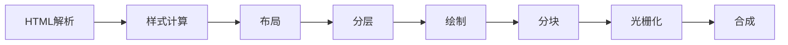
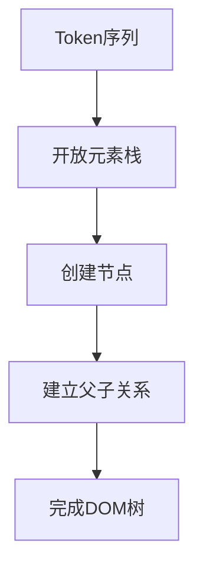
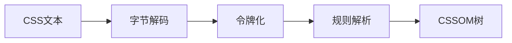
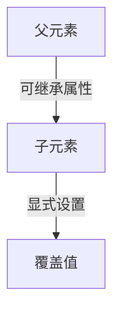
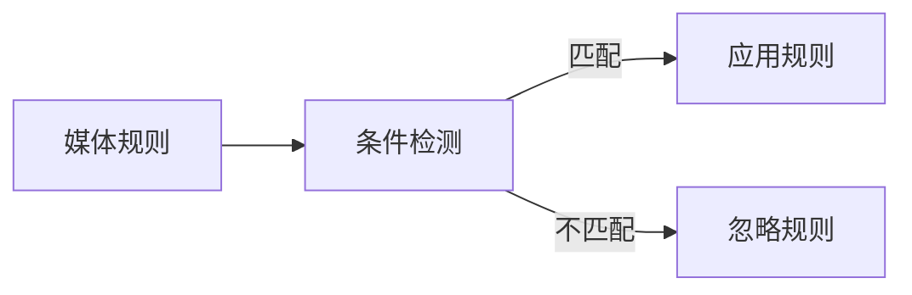

## 浏览器的多进程架构

### 进程与线程

**进程**：
指计算机中已执行的程序，曾经是分时系统的基本运作单位。在面向进程设计的系统中，是程序的基本执行实体；在面向线程设计的系统中，进程本身不是基本执行单位，而是线程的容器。  
**线程**：
进程内的执行单元，是 CPU 调度的基本单位。

参考：[进程](https://zh.wikipedia.org/zh-cn/%E8%A1%8C%E7%A8%8B)、[线程](https://zh.wikipedia.org/zh-cn/%E7%BA%BF%E7%A8%8B)

### 现代浏览器的进程架构

Chrome 为代表的现代浏览器采用多进程架构，主要进程类型包括：

| 进程类型     | 职责                                      |
| ------------ | ----------------------------------------- |
| 浏览器主进程 | 管理界面、存储、下载等核心功能            |
| GPU 进程     | 处理图形渲染任务                          |
| 网络进程     | 管理网络请求和响应                        |
| 存储进程     | 处理缓存和存储操作                        |
| **渲染进程** | **核心：将 HTML/CSS/JS 转换为可交互页面** |
| 插件进程     | 管理第三方插件                            |

下面是浏览器的实际进程截图：

<ImageBuilder :source="['浏览器进程架构.png']" size="medium"/>

其中，**渲染进程**是我们最应该关注的进程，它负责通过一系列渲染步骤（又称作浏览器渲染管线）将 HTML、JavaScript、CSS、图片等资源最终解析为可以显示和交互的页面。

**渲染进程管理规则**：

- 打开新标签页 → 创建新渲染进程
- 页面导航决策：

  ```mermaid
  flowchart TD
  A[新页面请求] --> B{与当前页面是否同站？}
  B -->|是| C[复用当前渲染进程]
  B -->|否| D[创建新渲染进程]
  ```

  - 同站判定：相同的 eTLD+1（有效顶级域名+二级域名）
  - 示例：
    - ✅ `www.baidu.com`与`tieba.baidu.com` → 同站
    - ❌ `www.baidu.com`与`www.taobao.com` → 不同站

如下图所示：
<ImageBuilder :source="['浏览器进程架构-同站进程复用1.png','浏览器进程架构-同站进程复用2.png','浏览器进程架构-同站进程复用3.png']" size="medium" />

> 多进程架构的优势：崩溃隔离，沙箱化等，参考[Chrome 中多进程架构的好处](https://developer.chrome.com/blog/inside-browser-part1?hl=zh-cn#the_benefit_of_multi-process_architecture_in_chrome)

---

## 浏览器渲染管线

我们把从输入数据（通常是 HTML、CSS、JavaScript）到显示结果（屏幕上看到的画面）这整个过程称为浏览器的渲染流程，或者叫渲染管线。

完整的渲染管线流程：



这个过程也被称为[关键渲染路径(Critical Rendering Path)](https://developer.mozilla.org/en-US/docs/Web/Performance/Critical_rendering_path)。

---

### 1. HTML 解析与 DOM 树构建

HTML 解析是浏览器渲染管线的第一步，它将 HTML 文档转换为 DOM 树。这个过程遵循[WHATWG HTML 标准](https://html.spec.whatwg.org/multipage/parsing.html#parsing)中定义的算法。

#### 1.1 字节流解码（Byte Decoding）

**目标**：将原始字节流转换为可读字符

**编码识别优先级**：

1. 🥇[BOM 嗅探](https://encoding.spec.whatwg.org/#bom-sniff) （BOM sniffing）最高优先级
2. 🥈HTTP 头中的`Content-Type`（如`Content-Type: text/html; charset=UTF-8`）
3. 🥉HTML 文档中的 `<meta>`声明
   - 对于 HTML5 文档，优先识别`<meta charset="UTF-8">`
   - 对于旧版 HTML，识别`<meta http-equiv="Content-Type" content="text/html; charset=GBK">`
4. 文档关联/资源路径推测
   > **特殊情况**：同时存在 BOM 和 HTTP charset 声明时，**BOM 优先级更高**

#### 1.2 令牌化（Tokenization）

**目标**：将字符串切割为有意义的语法单元（Tokens）

**分词规则**：

| 输入               | 输出 Token 类型 | 示例                  |
| ------------------ | --------------- | --------------------- |
| `<div>`            | 开始标签        | `StartTag: div`       |
| `</div>`           | 结束标签        | `EndTag: div`         |
| `class="title"`    | 标签属性        | 作为开始标签的一部分  |
| `Hello World`      | 文本            | `Text: "Hello World"` |
| `<!-- comment -->` | 注释            | `Comment: "comment"`  |

**容错机制**：自动修正错误语法（如未闭合标签、错误嵌套）

#### 1.3 DOM 树构建（Tree Construction）

**目标**：将 Token 序列转换为具有层级关系的 DOM（文档对象模型）树

**核心过程**：



**关键技术细节**：

- 使用[开放元素栈](https://html.spec.whatwg.org/multipage/parsing.html#the-stack-of-open-elements)维护元素的层级关系
- **脚本处理规则**：
  - 遇到`<script>`时暂停 DOM 构建并执行脚本（除非标记`async`/`defer`）
  - 特殊行为：调用`document.write()`会插入内容到当前位置并重启解析
- **自动补全和纠错**：
  - 自动补全缺失的`<html>`/`<head>`/`<body>`
  - 纠正错误的嵌套顺序（如`<p>`内嵌`<div>`）
  - 处理未闭合的标签

#### 1.4 触发文档就绪事件（Document Readiness）


#### 构建过程的核心优化机制

- **增量构建（Incremental Build）**

  - 浏览器采用增量构建策略，在解析过程中**分批生成 DOM 节点**（无固定大小阈值），允许用户提前看到部分内容（如文本先显示）

- **预解析扫描器（Preload Scanner）**

  - 主解析器在解析 HTML 时，会启动一个轻量级的扫描器（独立线程）提前发现并下载 CSS/JS/图片资源

- **回流最小化（Layout Thrashing Avoidance）**

  - 构建过程中如果 JS 读取布局属性（如 offsetHeight），会强制触发同步布局计算（重排），导致性能问题，因此应避免在 DOM 构建过程中读取布局属性

### 2. 样式计算

样式计算是浏览器渲染管线中的关键步骤，它将 DOM 树和 CSS 规则结合生成带有样式的渲染树。此过程遵循[W3C CSS Syntax Level 3](https://www.w3.org/TR/css-syntax-3/)和[CSS Cascading and Inheritance Level 4](https://www.w3.org/TR/css-cascade-4/)等规范。

#### 2.1 CSSOM 树构建



**关键步骤**：

1. **CSS 解析器初始化**

   - 创建样式表对象（CSSStyleSheet）
   - 初始化规则列表（CSSRuleList）

2. **规则解析**：
   ```javascript
   // CSS 规范定义的规则类型（根据CSS Object Model规范）
   interface CSSRule {
   	const unsigned short      STYLE_RULE = 1;
   	const unsigned short      CHARSET_RULE = 2;
   	const unsigned short      IMPORT_RULE = 3;
   	const unsigned short      MEDIA_RULE = 4;
   	const unsigned short      FONT_FACE_RULE = 5;
   	const unsigned short      PAGE_RULE = 6;
   	const unsigned short      KEYFRAMES_RULE = 7;
   	const unsigned short      NAMESPACE_RULE = 10;
   }
   ```
3. **错误处理**：
   - 根据 [CSS Parsing Level 3 规范](https://www.w3.org/TR/css-syntax-3/#error-handling)，跳过无效规则
   - 保留有效部分继续解析

#### 2.2 规则匹配

**匹配过程**：


**匹配算法**：

1. **从右向左匹配**：
   - 先匹配最具体的选择器部分（如.class 或#id）
   - 再验证祖先关系（如 div .class）
2. **选择器特异性计算**：

   ```text
   特异性值 = (a, b, c, d)
   a = 来自style属性的规则（存在则为1，否则0）
   b = ID选择器的规则数量
   c = 类/属性/伪类选择器的规则数量
   d = 元素/伪元素选择器的规则数量
   ```

3. **规则匹配优化**：
   - 对常见选择器模式建立索引（如类选择器 → 元素列表映射）
   - 采用分层过滤（先匹配具体选择器，再验证祖先关系）
   - 编译选择器为字节码提升执行效率

#### 2.3 层叠顺序计算

样式层叠遵循[CSS Cascading and Inheritance 规范](https://www.w3.org/TR/css-cascade-4/#cascading)定义的层叠顺序：

1. **来源优先级（升序）**：

   ```text
   用户代理声明（user agent declarations）
   用户普通声明（user normal declarations）
   作者普通声明（author normal declarations）
   作者重要声明（author important declarations）
   用户重要声明（user important declarations）
   ```

   > 名词解释：用户代理声明，浏览器厂商提供的默认样式（即浏览器内置样式）；用户声明，浏览网站的用户定义的样式（比如通过插件书写的样式）；作者声明，由网站开发者编写的 CSS 样式，包括内联样式、嵌入样式、外部样式。

2. **特异性比较**：

   - 比较`(a,b,c,d)`元组，从左到右比较数值
   - 例如：`(1,0,0,0) > (0,2,3,0)`

3. **出现顺序**：
   - 特异性相同的规则，后出现的覆盖先出现的

#### 2.4 继承属性处理

**继承机制**：



**关键规则**：

1. **继承值计算**：

   根据 [CSS Cascading and Inheritance 规范](https://www.w3.org/TR/css-cascade-4/#inheriting)：

   ```javascript
   // 如果属性是可继承属性，则使用父元素值，否则使用初始值
   if (property.isInherited) {
   	computedValue = parent.computedValue
   } else {
   	computedValue = initialValue
   }
   ```

2. **特殊关键字**：
   | 关键字 | 行为 |
   |--------|------|
   | `inherit` | 强制继承父元素值 |
   | `initial` | 使用规范初始值 |
   | `unset` | 自动继承或初始值 |
   | `revert` | 回滚到 UA 样式 |

#### 2.5 相对值转换

| 相对单位 | 转换依据           | 示例                           |
| -------- | ------------------ | ------------------------------ |
| em       | 父元素 `font-size` | 1em = 父元素的 `font-size` 值  |
| rem      | 根元素 `font-size` | 1rem = 根元素的 `font-size` 值 |
| %        | 包含块尺寸         | `width: 50%`                   |
| vw, vh   | 视口尺寸           | 1vw = 1%视口宽度               |
| ch, ex   | 字符尺寸           | 基于当前字体                   |
| calc()   | 数学表达式计算     | `calc(100% - 20px)`            |

#### 2.6 属性值标准化

**标准化操作**：

1. **简写属性展开**：

   ```css
   /* 输入 */
   margin: 10px;
   /* 展开为 */
   margin-top: 10px;
   margin-right: 10px;
   margin-bottom: 10px;
   margin-left: 10px;
   ```

2. **关键字转换**：

   - auto → 具体计算值
   - currentColor → 解析为当前 color 值

3. **规范化值**：
   - 颜色：RGB() → 十六进制颜色值
   - 长度：10em → px
   - ...

#### 2.7 媒体查询处理



#### 2.8 伪元素/类处理

**实际位置**：在渲染树阶段创建，不在样式计算阶段（不确定）


#### 关键优化策略

1. **增量样式计算**：仅更新受影响的"脏"节点
2. **样式共享**：相同样式规则复用计算结果
3. **惰性计算**：延迟访问时才计算布局属性
