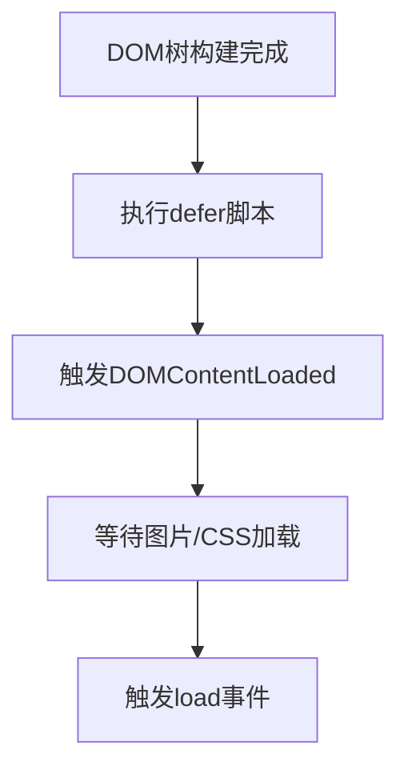
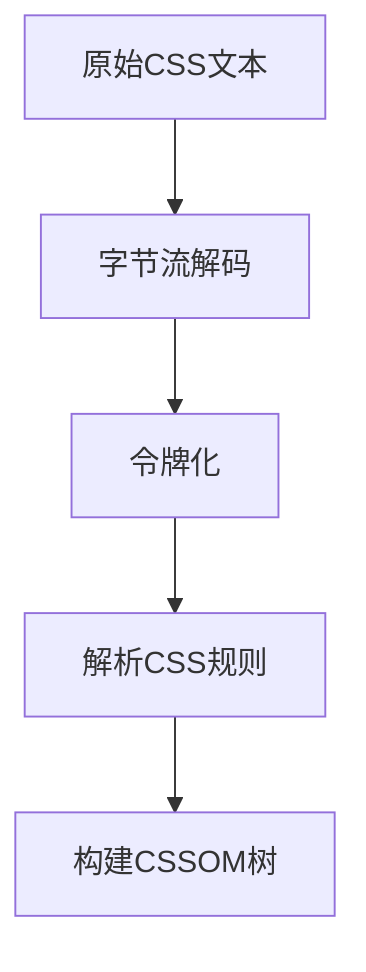
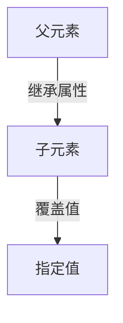
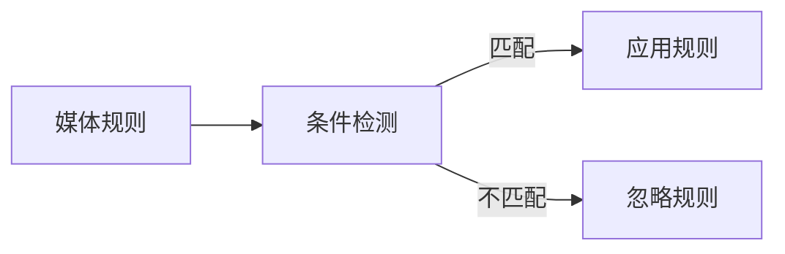

## 浏览器的多进程架构

### 进程与线程

**进程**：指计算机中已执行的程序，曾经是分时系统的基本运作单位。在面向进程设计的系统中，是程序的基本执行实体；在面向线程设计的系统中，进程本身不是基本执行单位，而是线程的容器。  
**线程**：在计算机科学中，是将进程划分为两个或多个线程（实例）或子进程，由单处理器（单线程）或多处理器（多线程）或多核处理系统并发执行。  
参考：[进程](https://zh.wikipedia.org/zh-cn/%E8%A1%8C%E7%A8%8B)、[线程](https://zh.wikipedia.org/zh-cn/%E7%BA%BF%E7%A8%8B)

### 浏览器的进程架构

**现代浏览器一般都是多进程架构**，以 Chrome 为例，一个浏览器会启动包括以下进程在内的多个进程，每个进程都有自己的内存空间，进程之间通过 `IPC` 进行通信：

- 浏览器主进程
- GPU 进程
- 网络进程
- 存储进程
- 渲染进程
- 插件进程

下面是浏览器的进程截图：

<ImageBuilder :source="['浏览器进程架构.png']" size="medium"/>

其中，**渲染进程**是我们最应该关注的进程，它负责通过一系列渲染步骤（又称作浏览器渲染管线）将 HTML、JavaScript、CSS、图片等资源最终解析为可以显示和交互的页面。

**浏览器中的渲染进程不止会有一个**，通常来讲，我们每次在浏览器中打开一个新的标签页，就会启动一个新的渲染进程。如果是在当前页面打开或跳转，浏览器会判断新页面是否与当前页面属于**同站页面**：

> 所谓同站：指的是两个 URL 具有**相同的有效顶级域名 + 二级域名部分**，也就是 eTLD+1

**如果是同站页面，则复用当前页面的渲染进程，否则就会启动一个新的渲染进程**。

> 对比同源：指的是 **协议(Scheme)**、**主机名(Hostname)** 和 **端口号(Port)** 完全相同。

如下图所示：
<ImageBuilder :source="['浏览器进程架构-同站进程复用1.png','浏览器进程架构-同站进程复用2.png','浏览器进程架构-同站进程复用3.png']" size="medium" />

`baidu.com` 和 `tieba.baidu.com` 复用同一个浏览器进程，因为它们是同站页面。  
而 `baidu.com` 和 `taobao.com` 则不会复用同一个浏览器进程，因为它们不是同站页面。

> 多进程架构的优势：崩溃隔离，沙箱化等，参考[Chrome 中多进程架构的好处](https://developer.chrome.com/blog/inside-browser-part1?hl=zh-cn#the_benefit_of_multi-process_architecture_in_chrome)

---

## 浏览器渲染管线

我们把从输入数据（通常是 HTML、CSS、JavaScript）到显示结果（屏幕上看到的画面）这整个过程称为浏览器的渲染流程，或者叫渲染管线。

按照渲染的时间顺序，渲染管线可分为如下几个子阶段：

1. 构建 DOM 树
2. 样式计算
3. 布局阶段
4. 分层阶段
5. 绘制阶段
6. 分块
7. 光栅化
8. 合成

这个过程也被称为[关键渲染路径(Critical Rendering Path)](https://developer.mozilla.org/en-US/docs/Web/Performance/Critical_rendering_path)。

### 1. HTML 解析与 DOM 树构建流程

HTML 解析是浏览器渲染管线的第一步，它将 HTML 文档转换为 DOM 树。这个过程遵循[WHATWG HTML 标准](https://html.spec.whatwg.org/multipage/parsing.html#parsing)中定义的算法。

#### 1.1 字节流解码（Byte Decoding）

**目标**：将原始字节流转换为可读字符  
**编码识别顺序**：

1. [BOM 嗅探](https://encoding.spec.whatwg.org/#bom-sniff) (BOM sniffing)（最高优先级）
2. 检查 HTTP 响应头中的`Content-Type`字段（如`Content-Type: text/html; charset=UTF-8`）
3. 检查文档是否与一个已确定编码的 `Document` 关联(需同源)，如果是，使用关联的 `Document` 编码
4. 检查 HTML 文档中的 `<meta>`标签
   - 对于 HTML5 文档，优先识别`<meta charset="UTF-8">`
   - 对于旧版 HTML，识别`<meta http-equiv="Content-Type" content="text/html; charset=GBK">`
5. 检查资源地址/用户地区设置

> BOM 优先级最高，若存在 BOM 则忽略 HTTP 头中的 charset 声明

---

#### 1.2 令牌化（Tokenization）

**目标**：将字符串切割为有意义的语法单元（Tokens）  
**分词规则**：

- `<div>` → **开始标签 Token**
- `</div>` → **结束标签 Token**
- `id="app"` → **属性 Token**（作为开始标签的一部分）
- `Hello` → **文本 Token**，标签之间的文字
- `<!-- 注释内容 -->` → **注释 Token**

这一阶段会处理 HTML 的 "容错性"：对不规范语法（如未闭合标签、错误嵌套）进行自动修正

---

#### 1.3 DOM 树构建（Tree Construction）

**目标**：将 Token 序列转换为具有层级关系的 DOM（文档对象模型）树  
**关键机制**：

- 使用[开放元素栈](https://html.spec.whatwg.org/multipage/parsing.html#the-stack-of-open-elements)维护元素的层级关系
- 根据令牌类型创建相应的节点：
  - 开始标签令牌创建元素节点
  - 文本令牌创建文本节点
  - 注释令牌创建注释节点
  - 结束标签令牌不创建节点，而是完成元素的构建
- 每个节点根据 HTML 规范确立父-子-兄弟关系

**HTML 容错处理**：

- 自动补全缺失的`<html>`、`<head>`、`<body>`标签
- 纠正错误的嵌套顺序（如`<p>`中嵌套`<div>`时自动闭合`<p>`）
- 处理未闭合的标签

**脚本处理**：

当解析器遇到`<script>`标签时，会暂停 DOM 构建并执行脚本：

1. 按文档顺序同步阻塞解析（除非标记`defer`/`async`）
2. 脚本仅能访问**已构建**的 DOM 节点
3. 特殊行为：
   - `document.write()`：在解析中调用时**插入新内容并重启解析**

---

#### 1.4 文档就绪事件（Document Readiness）

**事件触发逻辑**：



#### 构建过程的核心优化机制

- **增量构建（Incremental Build）**

  - 浏览器采用增量构建策略，在解析过程中**分批生成 DOM 节点**（无固定大小阈值），允许用户提前看到部分内容（如文本先显示）

- **预解析扫描器（Preload Scanner）**

  - 主解析器在解析 HTML 时，会启动一个轻量级的扫描器（独立线程）提前发现并下载 CSS/JS/图片资源

- **回流最小化（Layout Thrashing Avoidance）**

  - 构建过程中如果 JS 读取布局属性（如 offsetHeight），会强制触发同步布局计算（重排），导致性能问题，因此应避免在 DOM 构建过程中读取布局属性

### 2. 样式计算

样式计算是浏览器渲染管线中的关键步骤，它将 DOM 树和 CSS 规则结合生成带有样式的渲染树。此过程遵循[W3C CSS Syntax Level 3](https://www.w3.org/TR/css-syntax-3/)和[CSS Cascading and Inheritance Level 4](https://www.w3.org/TR/css-cascade-4/)等规范。

#### 2.1 CSSOM 树构建



**关键步骤**：

1. **CSS 解析器初始化**
   - 创建样式表对象（CSSStyleSheet）
   - 初始化规则列表（CSSRuleList）
2. **规则解析**：
   ```javascript
   // CSS 规范定义的规则类型（根据CSS Object Model规范）
   interface CSSRule {
   	const unsigned short      STYLE_RULE = 1;
   	const unsigned short      CHARSET_RULE = 2;
   	const unsigned short      IMPORT_RULE = 3;
   	const unsigned short      MEDIA_RULE = 4;
   	const unsigned short      FONT_FACE_RULE = 5;
   	const unsigned short      PAGE_RULE = 6;
   	const unsigned short      KEYFRAMES_RULE = 7;
   	const unsigned short      NAMESPACE_RULE = 10;
   }
   ```
3. **错误处理**：
   - 根据 [CSS Parsing Level 3 规范](https://www.w3.org/TR/css-syntax-3/#error-handling)，跳过无效规则
   - 保留有效部分继续解析

#### 2.2 样式规则匹配

**匹配过程**：


**匹配算法**：

1. **从右向左匹配**：
   - 先匹配最具体的选择器部分（如.class 或#id）
   - 再验证祖先关系（如 div .class）
2. **选择器特异性计算**：

```text
特异性值 = (a, b, c, d)
a = 来自style属性的规则（存在则为1，否则0）
b = ID选择器的规则数量
c = 类/属性/伪类选择器的规则数量
d = 元素/伪元素选择器的规则数量

```

3. **规则匹配优化**：
   - 使用 Bloom 过滤器快速排除不匹配规则
   - 对常见选择器模式建立索引

#### 2.3 优先级计算（层叠算法）

样式层叠遵循[CSS Cascading and Inheritance 规范](https://www.w3.org/TR/css-cascade-4/#cascading)定义的层叠顺序：

1. **来源优先级（升序）**：

   ```text
   1. 用户代理声明（user agent declarations）
   2. 用户普通声明（user normal declarations）
   3. 作者普通声明（author normal declarations）
   4. 作者重要声明（author important declarations）
   5. 用户重要声明（user important declarations）
   ```

   > 名词解释：用户代理声明，浏览器厂商提供的默认样式（即浏览器内置样式）；用户声明，浏览网站的用户定义的样式（比如通过插件书写的样式）；作者声明，由网站开发者编写的 CSS 样式，包括内联样式、嵌入样式、外部样式。

2. **特异性比较**：

   - 比较`(a,b,c,d)`元组，从左到右比较数值
   - 例如：`(1,0,0,0) > (0,2,3,0)`

3. **出现顺序**：
   - 特异性相同的规则，后出现的覆盖先出现的

#### 2.4 继承处理

**继承机制**：



**关键规则**：

1. **可继承属性**

   - 字体相关：font-family, font-size
   - 文本相关：color, line-height
   - 可见性：visibility
   - 列表属性：list-style

2. **继承值计算**：

   根据 [CSS Cascading and Inheritance 规范](https://www.w3.org/TR/css-cascade-4/#inheriting)：

   ```javascript
   if (property.isInherited) {
   	computedValue = parent.computedValue
   } else {
   	computedValue = initialValue
   }
   ```

3. **特殊关键字**：
   - inherit：强制继承父元素值
   - initial：使用规范初始值
   - unset：自动选择 inherit 或 initial
   - revert：回滚到用户代理样式

#### 2.5 默认值应用

1. **未定义属性处理**：

   - 使用属性规范定义的初始值
   - 例如：display 初始值为 inline

2. **CSS 全局关键字**：
   |关键字 |行为|
   |----|--|
   |initial| 将属性重置为 CSS 规范定义的初始值|
   |inherit| 继承父元素的值|
   |unset| 继承属性使用 inherit，非继承属性使用 initial|
   |revert| 回滚到用户代理样式|

3. **UA 样式表应用**：
   ```css
   /* 浏览器默认样式示例 */
   html {
   	display: block; /* 根元素初始值为block */
   }
   head {
   	display: none;
   }
   ```

#### 2.6 相对值转换

| 相对单位 | 转换依据       | 示例                   |
| -------- | -------------- | ---------------------- |
| em, rem  | 字体大小       | 1em = 父元素 font-size |
| %        | 包含块尺寸     | width: 50%             |
| vw, vh   | 视口尺寸       | 1vw = 1%视口宽度       |
| ch, ex   | 字符尺寸       | 基于当前字体           |
| calc()   | 数学表达式计算 | calc(100% - 20px)      |

**计算过程**：

1. 递归解析表达式
2. 单位统一转换
3. 最终值计算

#### 2.7 样式属性标准化

**标准化操作**：

1. **简写属性展开**：

   ```css
   /* 输入 */
   margin: 10px;

   /* 展开为 */
   margin-top: 10px;
   margin-right: 10px;
   margin-bottom: 10px;
   margin-left: 10px;
   ```

2. **关键字转换**：

   - auto → 具体计算值
   - currentColor → 解析为当前 color 值

3. **规范化值**：
   - 颜色：#RGB → #RRGGBB
   - 长度：0px → 0
   - 角度：360deg → 0deg

#### 2.8 媒体查询应用



**检测维度**：

1. 设备类型：screen, print, speech
2. 视口尺寸：width, height
3. 显示特性：resolution, orientation
4. 用户偏好：prefers-color-scheme

#### 2.9 伪元素/类处理

1. **伪类匹配**：

   ```javascript
   for (element of DOM) {
   	if (element.matches(':hover')) {
   		applyHoverStyles()
   	}
   }
   ```

2. **伪元素处理**：
   - 伪元素（如::before, ::after）不是真实 DOM 节点，而是在渲染时生成的虚拟节点
   - 应用对应样式规则并在渲染树中创建相应渲染对象

#### 2.10 计算样式树构建


**优化机制**：

1. 增量更新（仅修改受影响节点）
2. 样式共享（相同样式节点复用）
3. 缓存计算结果
