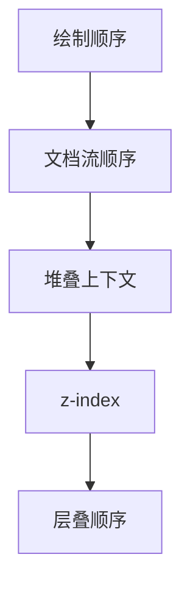

## 浏览器渲染管线

---

### 5 绘制（Painting）

绘制发生在主线程 ​​，目标是将布局树中的元素转换为**绘制指令列表（Paint Records）** ​​，为后续的合成阶段提供数据支持。

**关键步骤说明**：

- **生成绘制指令**：主线程遍历布局树，为每个元素生成 **绘制指令列表（Paint Records）**，描述其颜色、背景、边框、文本等视觉属性。
- **按层划分任务**：每个合成层（Compositing Layer）独立生成绘制指令，避免跨层混合。
- **提交至合成线程**：主线程将绘制指令和图层信息传递给合成线程，完成后续处理。

> 注意：绘制指令是一种底层的、描述如何渲染元素的抽象操作列表，实际由浏览器引擎生成。我们可以暂时理解为类似 `canvas api` 的指令集。

#### 5.1 绘制指令类型

| 指令类型     | 描述         | 示例             |
| ------------ | ------------ | ---------------- |
| `fillRect`   | 填充矩形区域 | 背景颜色、边框   |
| `drawText`   | 绘制文本     | 字体、颜色、阴影 |
| `drawImage`  | 绘制图像     | 背景图片、图标   |
| `drawBorder` | 绘制边框     | 边框样式、圆角   |
| `drawShadow` | 绘制阴影     | 文本阴影、盒阴影 |

#### 5.2 绘制顺序规则

| 因素                 | 说明                                                                   |
| -------------------- | ---------------------------------------------------------------------- |
| 文档流顺序           | 默认从上到下、从左到右绘制                                             |
| 堆叠上下文与 z-index | 不同堆叠上下文的元素按 `z-index` 排序，同一上下文内按 CSS 层叠规则排序 |

#### 5.3 触发重绘的操作

| 操作           | 是否触发重绘 | 说明                                       |
| -------------- | ------------ | ------------------------------------------ |
| 修改颜色、背景 | ✅           | 如 `element.style.backgroundColor = 'red'` |
| 修改字体大小   | ✅           | 如 `element.style.fontSize = '20px'`       |
| 修改 transform | ❌           | 直接由合成线程处理                         |
| 修改 opacity   | ❌           | 直接由合成线程处理                         |

#### 5.4 绘制指令的优化

**优化策略**：

- **减少绘制指令**：避免频繁修改样式，如批量读写布局属性。
- **合并绘制指令**：通过 `will-change` 或 `transform` 触发合成层，减少主线程压力。
- **简化 CSS 选择器**：避免复杂选择器（如`.box .title`），减少样式计算时间。
- **使用硬件加速**：通过 `transform: translateZ(0)` 或 `will-change: transform` 提升合成层性能。
