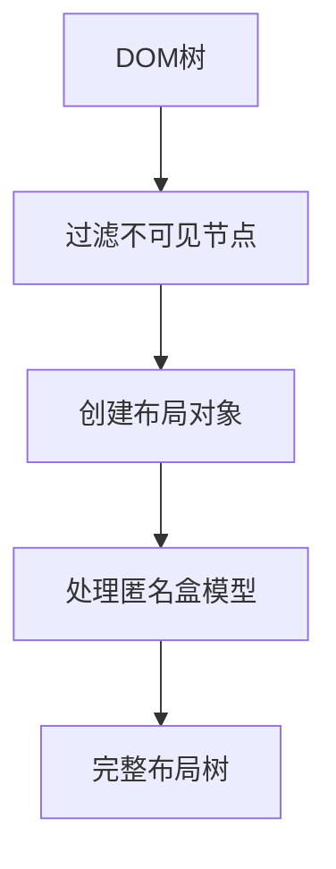
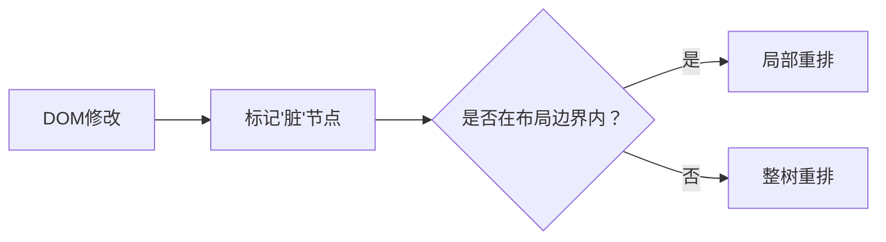
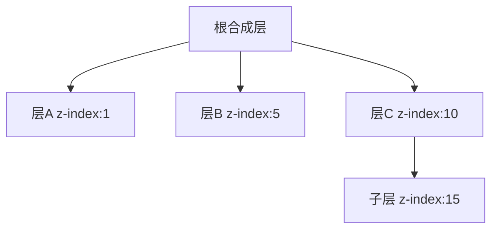

## 浏览器渲染管线

---

### 3. 布局阶段 (Layout / Reflow)

布局阶段是浏览器渲染管线的核心环节，主要任务是将样式计算阶段得到的计算样式转换为精确的几何位置信息。

#### 3.1 构建布局树（Layout Tree Construction）

**关键过程说明**：

| 步骤         | 具体操作                                                       | 关键说明                                                               |
| ------------ | -------------------------------------------------------------- | ---------------------------------------------------------------------- |
| 筛选可见元素 | 移除 `display: none` 的元素和不可见元素                        | **注意**：`visibility: hidden`的元素保留在布局树中（占据空间但不可见） |
| 创建布局对象 | 为可见元素创建**布局对象**，包含元素的样式信息和初始几何占位符 | 布局对象与 DOM 节点不完全一一对应（如相邻文本节点可能合并）            |
| 处理特殊节点 | - 伪元素（::before、::after）生成布局对象  - 处理匿名盒     | 匿名盒模型解决混合内容流的布局问题                                     |

> 布局树的核心：仅保留"会影响视觉呈现"的元素，为后续几何计算奠定基础。

> 关于匿名盒：
> | 匿名盒类型 | 产生场景 | 示例 |
> | ------ | -------- | ---- |
> | 匿名块盒 | 块级容器中混合块级元素和内联内容 | `
文本内联
块级
更多文本
`→ "更多文本"被匿名块盒包裹 |
> | 匿名行盒 | 块级容器中仅包含内联内容 | `
这是一段文本
`→ 文本被匿名行盒包裹|
>
> 匿名盒的核心作用：补全布局层级，确保所有内容符合 CSS 盒模型规则。

#### 3.2 布局计算（Layout Computation）

**目标**：为布局树中的每个节点计算精确的宽度、高度、位置（top/left/right/bottom），依赖于**包含块**（元素布局的"参考坐标系"）。

##### 3.2.1 确定包含块

包含块是元素布局的基准容器，其范围由祖先元素的属性决定，规则如下（按优先级排序）：

| 元素定位类型             | 包含块的建立规则                                                                          | 例外情况（祖先元素触发新包含块）                                                                                                                                                                                                                                     |
| ------------------------ | ----------------------------------------------------------------------------------------- | -------------------------------------------------------------------------------------------------------------------------------------------------------------------------------------------------------------------------------------------------------------------- |
| `static/relative/sticky` | 由**最近的块级祖先元素**的内容盒（content box）创建。                                     | 无                                                                                                                                                                                                                                                                   |
| `absolute`               | 由最**近的非`static`定位的祖先元素**的内边距盒（padding box）创建。若无，则为初始包含块。 | 祖先元素满足： - `transform/perspective` ≠ `none` - `will-change: transform/perspective`  - `contain: layout/paint/strict/content`  - `filter` ≠ `none` 或 `will-change: filter`（FireFox 浏览器） - `backdrop-filter` ≠ `none`（有些手册中没有这项） |
| `fixed`                  | 默认是**视口**（viewport）/分页媒体的**分页区域**                                         | 同上                                                                                                                                                                                                                                                                 |

> 参考： - [MDN 包含块](https://developer.mozilla.org/zh-CN/docs/Web/CSS/CSS_display/Containing_block) - [W3C CSS Positioned Layout](https://www.w3.org/TR/css-position-3/)

##### 3.2.2 递归计算几何属性

1. **计算顺序**：从根元素开始，逐层递归计算子元素（父元素尺寸影响子元素）。
2. **核心计算内容**：
   - 宽度/高度：受 `width/height`、`padding`、`border`、`margin` 及内容尺寸影响（如 `width: auto` 会根据内容自适应）。
   - 位置：`top/left` 等属性基于包含块的左上角计算（如 `position: absolute` 的 `left: 10px` 指距离包含块左边缘 10px）。
3. **处理特殊布局**：

| 布局模式         | 核心计算逻辑                                         | 规范参考                                                                                                             |
| ---------------- | ---------------------------------------------------- | -------------------------------------------------------------------------------------------------------------------- |
| 块级格式化上下文 | 垂直排列元素   处理边距折叠   包含浮动元素     | [W3C block-formatting-contexts](https://www.w3.org/TR/CSS2/visuren.html#block-formatting)                            |
| 弹性布局         | 主轴空间分配   交叉轴对齐   弹性因子计算       | [MDN 弹性盒布局](https://developer.mozilla.org/zh-CN/docs/Web/CSS/CSS_flexible_box_layout/Basic_concepts_of_flexbox) |
| 网格布局         | 网格轨道尺寸计算   项目位置对齐   隐式网格创建 | [MDN 网格布局](https://developer.mozilla.org/zh-CN/docs/Web/CSS/CSS_grid_layout/Basic_concepts_of_grid_layout)       |
| 浮动布局         | 脱离文档流   文字环绕处理   父元素塌陷         | [W3C floats](https://www.w3.org/TR/CSS2/visuren.html#floats)                                                         |

> 格式化上下文详解：[MDN 格式化上下文](https://developer.mozilla.org/zh-CN/docs/Web/CSS/CSS_display/Introduction_to_formatting_contexts)

#### 3.3 布局优化

**增量布局机制（Incremental Layout）**：

- 仅更新受影响子树（dirty subtree），避免全页面重排。

> **增量布局的限制**：
>
> 1. 若修改的节点位于布局树的根部（如 `<body>`），可能触发全树重排。
> 2. 某些属性（如 `width`、`height`）的修改可能影响父元素，导致向上回溯计算。
>
> 参考：[Web Dev howbrowserswork](https://web.dev/articles/howbrowserswork?hl=zh-cn#layout)

### 4. 分层阶段（Layer Stage）

分层阶段（Layer）是连接布局（Layout）与绘制（Paint）的关键环节，核心任务是将布局树中的元素分配到不同的渲染层（Render Layers），目的是通过隔离动态元素、复用静态内容提升渲染效率。

#### 4.1 识别需要分层的元素

**分层触发条件**：

| 触发类型     | 触发条件                                                                                                                                  | 示例                                                                     |
| ------------ | ----------------------------------------------------------------------------------------------------------------------------------------- | ------------------------------------------------------------------------ |
| 默认分层     | 文档根元素（`<html>`）                                                                                                                    | 页面最基础的层，所有元素默认基于此层布局                                 |
| 定位与堆叠   | - `position: fixed/sticky`  - `z-index` ≠ `auto` 且 `position: absolute/relative`  - `z-index` ≠ `auto` 且是 flex/grid 容器的子元素 | `

`                   |
| 视觉效果属性 | - `opacity < 1`（半透明元素）  - `mix-blend-mode` ≠ `normal`   - `transform/perspective/filter/backdrop-filter/clip-path` ≠ `none`  | 动画元素常用`transform`触发分层以利用 GPU 加速                           |
| 媒体与插件   | - `<video>`、`<canvas>`、`<iframe>`（独立渲染单元）   - WebGL 上下文                                                                   | 视频播放区域需独立分层避免干扰其他内容                                   |
| 溢出与滚动   | `overflow: auto/scroll` 且内容可滚动（滚动容器会生成层以优化滚动性能）                                                                    | 长列表滚动区域（如`

`） |
| 主动提示     | `will-change: 可以触发分层的属性`（告知浏览器元素即将变化，提前分层）                                                                     | `

`（预优化动画元素）          |

#### 4.2 创建渲染层与合成层

分层并非单一层级，而是存在 **"渲染层 → 合成层"** 的升级关系：

| 层级类型 | 特点                                                                                | 优化机制                                                          |
| -------- | ----------------------------------------------------------------------------------- | ----------------------------------------------------------------- |
| 渲染层   | 包含元素绘制指令  管理层叠顺序  处理裁剪区域                                  | 同一渲染层内的绘制指令合并                                        |
| 合成层   | 独立的 GPU 纹理   直接由合成线程处理   支持 GPU 加速动画（transform/opacity） | 静默层合并   瓦片化渲染（大层拆分为可视区域瓦片）  纹理复用 |

#### 4.3 处理堆叠顺序

1. **层叠上下文规则**：

   - 每个层有自己的"层序"（类似全局 z-index）
   - 堆叠顺序遵循[CSS Positioned Layout 3](https://www.w3.org/TR/css-position-3/#stacking-context)规范
   - 子层无法超出父层的堆叠范围

2. **合成层排序**：

#### 4.4 层的优化

- **层合并**：
  相邻静态层（如无动画的`
`）会被合并，减少 GPU 内存占用（如多个静态文本块合并为一个 "文本层"）。
- **层拆分**：
  过大的层（如长列表）会被拆分为 "瓦片层"，仅绘制可视区域的瓦片，避免一次性绘制整个大层（参考 Chrome 的 Tiling 机制）。
