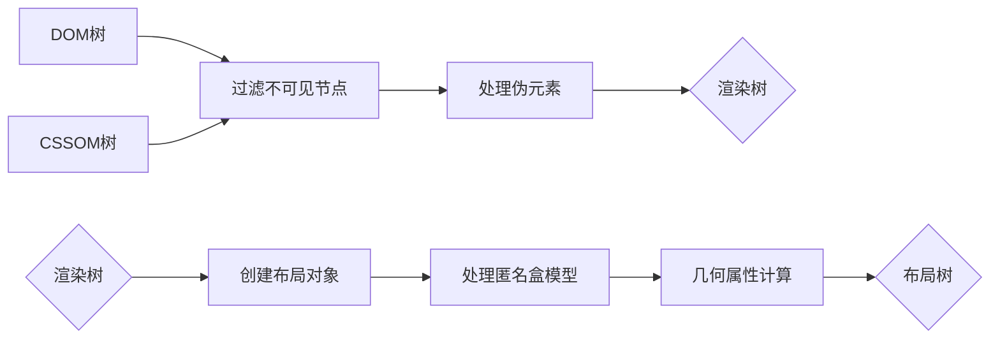

## 浏览器渲染管线

### 3. 布局阶段 (Layout / Reflow)

布局阶段是将样式计算结果转换为精确几何尺寸的过程，其核心目标是确定每个可见元素在屏幕上的**位置**和**大小**。

#### 3.1. 构建布局树（Layout Tree Construction）

布局树是对渲染树的几何属性（位置、尺寸）计算后生成的树结构，仅包含需参与几何计算的可见节点：



**关键步骤说明**：

| 步骤                                          | 操作细节                                                                   | 关键说明                                                    |
| --------------------------------------------- | -------------------------------------------------------------------------- | ----------------------------------------------------------- |
| 过滤不可见节点 **（在渲染树构建阶段已完成）** | 移除 `display: none` 的元素；保留 `visibility: hidden`（占据空间但不可见） | `visibility: hidden` 仍参与布局计算                         |
| 创建布局对象                                  | 为可见元素生成布局对象（LayoutObject），包含样式信息和初始几何属性         | 布局对象与 DOM 节点不完全一一对应（如相邻文本节点可能合并） |
| 处理匿名盒模型                                | 补全混合内容流的布局层级（如块级容器内的内联内容）                         | 解决 CSS 盒模型规则下的内容排列问题（见下表示例）           |
| 计算几何属性                                  | 根据样式信息计算几何属性（如`width/height`、`margin/padding`、`position`） | 依赖**包含块**（元素布局的参考坐标系）                      |

**匿名盒模型示例**：
| 匿名盒类型 | 产生场景 | 示例 HTML | 布局结果 |
|------------------|--------------------------------------------------------------------------|--------------------------------------------------------------------------|--------------------------------------------------------------------------|
| 匿名块盒 | 块级容器中混合块级元素和内联内容 | `<div>文本<span>内联</span><p>块级</p>更多文本</div>` | 生成包含"文本"和"更多文本"的两个匿名块盒，与`<p>`块级元素垂直排列 |
| 匿名行盒 | 块级容器中仅包含内联内容 | `<p>这是一段需要换行的文本</p>` | 文本被包裹在匿名行盒中，根据容器宽度自动换行 |

> **注意**：匿名盒无法通过 JavaScript 直接访问，但会影响布局计算（如边距折叠、行高计算）。参考：[MDN 匿名盒](https://developer.mozilla.org/zh-CN/docs/Web/CSS/CSS_display/Visual_formatting_model#%E7%9B%92%E5%AD%90%E7%94%9F%E6%88%90)

#### 3.2. 布局计算（Layout Computation）

布局计算的核心是为布局树中的每个节点计算精确的宽度、高度、位置（top/left/right/bottom），依赖**包含块**（元素布局的参考坐标系）。

##### 3.2.1. 包含块的确定规则

| 元素定位类型             | 包含块规则                                                                         | 例外情况（触发新包含块的祖先属性）                                                                                                                                                                                                                               |
| ------------------------ | ---------------------------------------------------------------------------------- | ---------------------------------------------------------------------------------------------------------------------------------------------------------------------------------------------------------------------------------------------------------------- |
| `static/relative/sticky` | 由最近的块级祖先元素的**内容盒（content box）** 创建                               | 无                                                                                                                                                                                                                                                               |
| `absolute`               | 由最近的非`static`定位祖先元素的**内边距盒（padding box）** 创建；无则用初始包含块 | 祖先满足以下任一条件：<br>1. `transform/perspective` ≠ `none`<br>2. `will-change: transform/perspective`<br>3. `filter` ≠ `none` 或者 `will-change: filter`（Firefox） <br>4. `contain: layout/paint/strict/content` <br>5. `backdrop-filter` ≠ `none`（有争议） |
| `fixed`                  | 默认由视口（viewport）或分页媒体的分页区域创建                                     | 同上（`transform`等属性会改变包含块）                                                                                                                                                                                                                            |

> 参考：<br>- [MDN 包含块](https://developer.mozilla.org/zh-CN/docs/Web/CSS/CSS_display/Containing_block)<br>- [W3C CSS Positioned Layout](https://www.w3.org/TR/css-position-3/#containing-block)

##### 3.2.2. 几何属性计算顺序与特殊布局

布局计算以"包含块"为单位递归：先计算父包含块的几何属性，再基于此计算子元素的位置与尺寸，整体遵循"从包含块到子元素"的依赖顺序

| 计算内容         | 依赖因素                                                                         | 特殊布局模式的影响                                                                 |
| ---------------- | -------------------------------------------------------------------------------- | ---------------------------------------------------------------------------------- |
| 宽度/高度        | `width/height`、`padding`、`border`、`margin`、内容尺寸（如`width: auto`自适应） | 块级格式化上下文（BFC）会垂直排列元素并合并边距；弹性布局（Flexbox）按主轴分配空间 |
| 位置（top/left） | 包含块的左上角坐标 + 自身定位属性（如`position: absolute`的`left: 10px`）        | 浮动布局（Float）会脱离文档流，父元素可能高度塌陷；网格布局（Grid）按轨道对齐      |

**特殊布局模式对比**：
| 布局模式 | 核心特性 | 典型应用场景 |
|------------------|--------------------------------------------------------------------------|------------------------------------------------------------------------------|
| 块级格式化上下文（BFC） | 垂直排列元素、合并边距、包含浮动元素 | 防止浮动父元素高度塌陷（`overflow: hidden`触发 BFC） |
| 弹性布局（Flexbox） | 主轴/交叉轴空间分配、弹性因子、对齐控制 | 一维布局（导航栏、卡片列表） |
| 网格布局（Grid） | 二维轨道划分、隐式网格创建、对齐控制 | 复杂二维布局（仪表盘、网格图库） |
| 浮动布局（Float） | 元素脱离文档流、文字环绕、父元素高度塌陷 | 多列布局（传统新闻网站） |

> 参考：<br>- [MDN 块级格式化上下文](https://developer.mozilla.org/zh-CN/docs/Web/CSS/CSS_display/Block_formatting_context)<br>- [MDN 弹性布局](https://developer.mozilla.org/zh-CN/docs/Web/CSS/CSS_flexible_box_layout)<br>- [MDN 网格布局](https://developer.mozilla.org/zh-CN/docs/Web/CSS/CSS_grid_layout)<br>- [MDN 浮动布局](https://developer.mozilla.org/zh-CN/docs/Learn_web_development/Core/CSS_layout/Floats)

#### 3.3. 增量布局与性能优化

为避免全量重排（Full Reflow），浏览器采用**增量布局**策略，仅更新受影响的子树。

**增量布局机制（Incremental Layout）**：


**关键规则**：

- **脏节点**：当 DOM 结构、样式或几何属性发生变化时，可能需要重建布局树。
- **布局边界**：父节点的布局范围限制（如`overflow: hidden`的容器会截断子节点的重排影响）。

> 参考：[Web Dev howbrowserswork](https://web.dev/articles/howbrowserswork?hl=zh-cn#layout)

**避免布局抖动（Layout Thrashing）**：

```javascript
// 错误示例：连续交叉读写布局属性导致触发多次重排
// 步骤1：写操作（修改width）
element.style.width = '100px'
// 浏览器：暂存这个修改，标记为脏节点，不立即布局

// 步骤2：读操作（获取offsetWidth）
const width = element.offsetWidth
// 浏览器：必须返回最新宽度，所以强制执行步骤1的布局计算（第一次布局）

// 步骤3：写操作（修改height）
element.style.height = '200px'
// 浏览器：暂存这个修改，标记为脏节点，等待下一次布局时机
```

- **后果**：每次读操作都会触发浏览器立即执行重排，导致性能损耗。
- **优化**：

```javascript
// 读写分离：先批量读，再批量写；或者先批量写，再批量读
requestAnimationFrame(() => {
	// 1. 先读后写（推荐）
	// 先执行读操作（获取当前布局信息，利用缓存，无强制同步布局）
	const width = element.offsetWidth
	// 再执行所有写操作（批量暂存）
	element.style.width = '100px'
	element.style.height = '200px'

	// 2. 先写后读
	// 先执行所有写操作（批量暂存）
	element.style.width = '100px'
	element.style.height = '200px'
	// 最后执行读操作（依然会触发一次强制同步布局）
	const width = element.offsetWidth
})
```

**关键结论**：
连续的多次读操作（中间无写操作）是安全的，浏览器会通过缓存机制优化，不会重复计算布局，性能开销很小。
**真正需要避免的是 “写 - 读 - 写”“读 - 写 - 读” 这类读写交替的操作，它们会频繁打破浏览器的优化机制，导致多次布局计算**。

### 4. 分层阶段（Layer Stage）

分层阶段的目标是将布局树中的元素分配到不同的渲染层（Render Layers），通过隔离动态内容、复用静态内容提升渲染效率。

#### 4.1. 分层触发条件

渲染层的拆分通常与层叠上下文（Stacking Context）密切相关，而层叠上下文的实际触发条件如下：

| 触发类型     | 具体条件                                                                                                                        | 示例 HTML/CSS                                                    |
| ------------ | ------------------------------------------------------------------------------------------------------------------------------- | ---------------------------------------------------------------- |
| 默认分层     | 文档根元素（`<html>`）                                                                                                          | `<html>...</html>`                                               |
| 定位与堆叠   | - `position: absolute/relative`且`z-index ≠ auto`<br> - `position: fixed/sticky`<br>- flex/grid 容器的子元素且 `z-index ≠ auto` | `<div style="position: absolute; z-index: 10;"></div>`           |
| 视觉效果属性 | - `opacity < 1`<br>- `mix-blend-mode ≠ normal`<br>- `transform/perspective/filter/backdrop-filter/clip-path/mask ≠ none`        | `<div style="transform: translateZ(0);"></div>`（触发 GPU 加速） |
| 媒体与插件   | `<video>`、`<canvas>`、`<iframe>`、WebGL 上下文                                                                                 | `<video src="video.mp4" controls></video>`                       |
| 溢出与滚动   | `overflow: auto/scroll`且内容超出容器尺寸（产生实际滚动条）                                                                     | `<div style="overflow: auto; height: 300px;">长内容...</div>`    |
| 主动提示     | - `will-change: 可触发分层的属性`（如`transform`、`opacity`）<br>- `contain: layout/paint/strict/content`                       | `<div style="will-change: transform;"></div>`（预优化动画元素）  |

> 参考： [MDN 层叠上下文](https://developer.mozilla.org/zh-CN/docs/Web/CSS/CSS_positioned_layout/Stacking_context)

##### 4.1.1 层叠上下文绘制顺序

| 顺序  | 绘制内容                      | 详细说明                                                                             |
| ----- | ----------------------------- | ------------------------------------------------------------------------------------ |
| **1** | **自身背景与边框**            | 层叠上下文元素的背景和边框最先绘制                                                   |
| **2** | **负 z-index 子层叠上下文**   | 递归处理所有`z-index < 0`的子层叠上下文<br>（按 z-index 升序，同值按 DOM 顺序）      |
| **3** | **文档流内容**                | 按顺序绘制：<br>1. 块级元素（背景/边框）<br>2. 浮动元素<br>3. 行内元素（含文本装饰） |
| **4** | **z-index:auto/0 的定位元素** | 绘制定位元素及其内容<br>（若创建新层叠上下文则递归处理）                             |
| **5** | **正 z-index 子层叠上下文**   | 递归处理所有`z-index >= 1`的子层叠上下文<br>（按 z-index 升序，同值按 DOM 顺序）     |
| **6** | **轮廓(outline)**             | 最后绘制所有元素的轮廓线                                                             |

> **特殊说明（根层叠上下文差异）**：
>
> - **根元素背景**：仅根层叠上下文需要先绘制整个画布背景
> - **绘制范围**：根层叠上下文的背景覆盖无限画布，普通层叠上下文的背景限定在元素边界内
>
> 参考：[w3c 层叠上下文的详细描述](https://www.w3.org/TR/CSS2/zindex.html#painting-order)

##### 4.1.2 层叠上下文绘制示例

```html
<div
	class="A"
	style="position: relative; z-index: 1"
>
	<!-- 层叠上下文 -->
	背景A
	<div
		class="B"
		style="position: absolute; z-index: -1"
	>
		<!-- 负z-index子上下文 -->
		背景B（递归步骤2）
		<div
			class="C"
			style="opacity: 0.8"
		>
			<!-- 隐式层叠上下文 -->
			内容C（在B的递归中处理）
		</div>
	</div>
	<div
		class="D"
		style="float: left"
	>
		浮动元素（步骤3）
	</div>
	<div
		class="E"
		style="position: absolute; z-index: 0"
	>
		<!-- z-index:0 -->
		内容E（步骤4）
	</div>
	<div
		class="F"
		style="position: absolute; z-index: 2"
	>
		<!-- 正z-index子上下文 -->
		背景F（递归步骤5）
	</div>
</div>
```

**递归绘制顺序详解**：

1. 绘制 A 的背景和边框
2. 递归处理 B（负 z-index 子上下文）：
   - 绘制 B 的背景和边框
   - 递归处理 C（opacity 创建的隐式层叠上下文）：
     - 绘制 C 的背景和边框
     - 绘制 C 的文档流内容
3. 绘制 A 的文档流内容：
   - 块级元素
   - 浮动元素 D
   - 行内元素
4. 绘制定位元素 E（z-index:0）及其内容
5. 递归处理 F（正 z-index 子上下文）：
   - 绘制 F 的背景和边框
   - 绘制 F 的内容
6. 绘制所有元素的外轮廓(outline)

> **关键特点**：
>
> 1. **层级隔离**：每个子层叠上下文独立绘制，不受外部 z-index 影响
> 2. **深度优先递归**：遇到子层叠上下文时立即展开处理
> 3. **位置决定顺序**：
>    - 负 z-index 内容在父背景后、文档流前
>    - 正 z-index 内容在文档流后、轮廓前
> 4. **创建方式无关**：无论通过 z-index/opacity/transform 等何种方式创建，绘制规则一致

#### 4.2. 渲染层与合成层的层级关系

分层并非单一层级，而是存在"渲染层 → 合成层"的升级关系：


| 层级类型 | 特性与优化                                           | 典型场景                                                         |
| -------- | ---------------------------------------------------- | ---------------------------------------------------------------- |
| 渲染层   | 存储绘制指令，管理层叠顺序                           | 静态文本块、无动画的按钮                                         |
| 合成层   | 独立 GPU 纹理、由合成线程直接处理、支持 GPU 加速动画 | 动画元素（`transform: translate`）、半透明浮层（`opacity: 0.8`） |

#### 4.3. 层的堆叠与排序

层叠顺序由**层叠上下文**决定，子层无法超出父层的堆叠范围。

- 见本文 → [4.1.1 层叠上下文绘制顺序](#_4-1-1-层叠上下文绘制顺序)。

#### 4.4. 层的优化策略

浏览器通过合并与拆分层平衡内存与性能：
| 优化操作 | 触发条件 | 性能影响 |
|------------------|--------------------------------------------------------------------------|--------------------------------------------------------------------------|
| 层合并 | 同层级且无重叠的静态层 | 减少 GPU 内存占用，降低合成开销 |
| 层拆分（瓦片化） | 大尺寸层（如长列表）、超出视口的层 | 拆分为 256x256 瓦片，仅光栅化可视区域，减少内存占用 |
| 层提升（Promote）| 动画元素（`transform/opacity`）、频繁重绘的元素 | 提升至合成层，避免触发重排重绘 |

> **最佳实践**：对动画元素使用`transform`替代`top/left`，触发合成层以提升性能。
